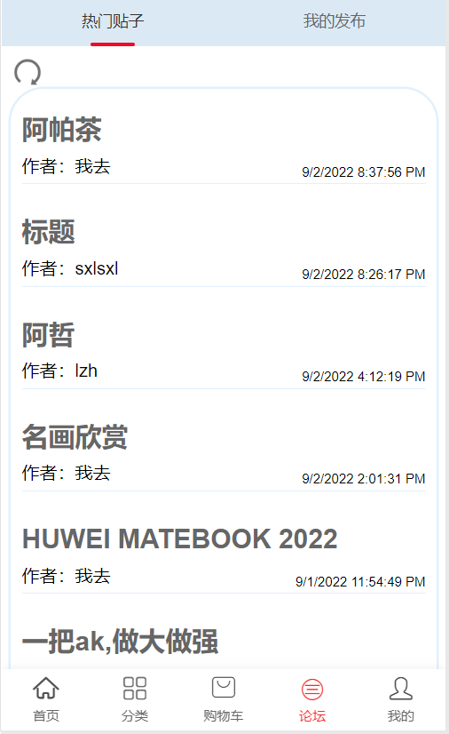
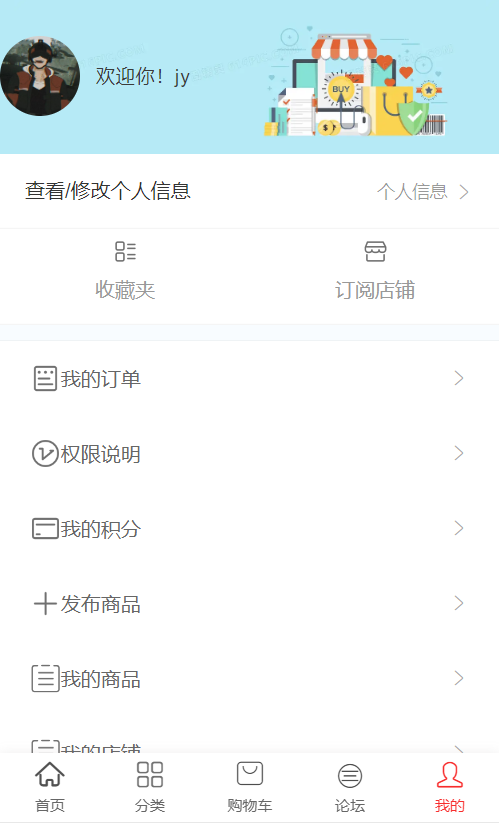
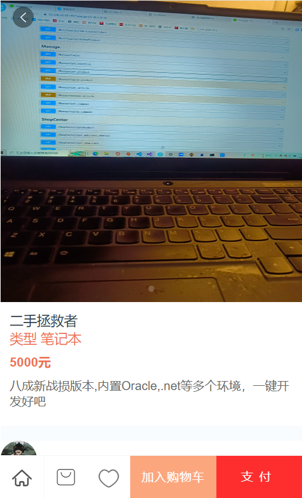

# 技术栈

vue2.0 + vue-router + vuex + axios

## 简介

项目已部署,地址为:http://106.12.131.109:8081/#/  
目前支持手机访问,电脑端访问需要开发者工具内更换为移动端

## 页面预览

   
   


## 经验

1. 事先一定要先想好整个页面组成，将一些常用的页面组件化开发,避免代码复用的情况发生

2. 用vuex可以减少组件间频繁传参,提高效率,但是要注意清除时间

3. 用axios时记得在catch内和then内都给出相应的弹出提示,提升用户体验

4. 记得经常pull和pr,减少冲突


## 项目运行方式

``` bash
# 安装相关依赖
npm install

# 本地运行,端口为8081
npm run dev

```


## 须知
Vant组件库可以正常安装了，那就不用element ui了。
Vant的链接在https://vant-contrib.gitee.io/vant/v2/#/zh-CN/quickstart ，安装Vant 2就能用了

